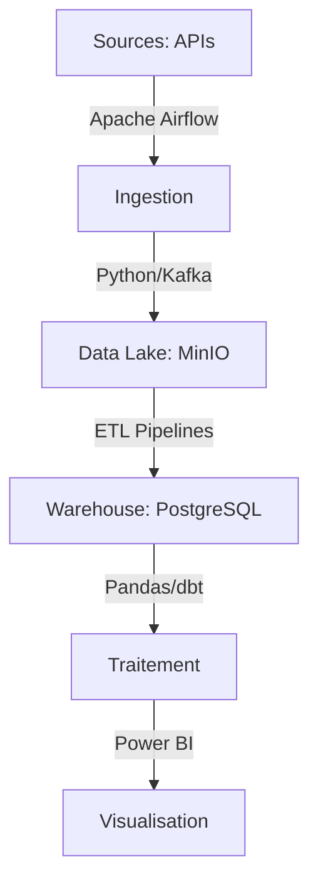

# Projet GoodAir - TotalGreen

<div align="center">
  
  <h3>Laboratoire de recherche pour la qualité de l'air et de l'eau</h3>
</div>

<div style="margin: 20px 0;">
  <h2 align="center">🌿 À propos du projet</h2>
  <p>
    <b>GoodAir</b> est un laboratoire de recherche développé par TotalGreen, dédié à l'analyse de la qualité de l'air et de l'eau en France. Notre mission est de surveiller ces éléments environnementaux pour proposer des recommandations au public, étudier les conséquences du changement climatique, et déterminer des seuils d'alerte.
  </p>
</div>

<hr />

## 🎯 Objectifs du projet

- Développer une plateforme Big Data pour collecter et analyser les données de qualité d'air et météorologiques
- Fournir des rapports et visualisations aux chercheurs du laboratoire
- Détecter les variations extrêmes et alerter les équipes concernées
- Permettre l'exportation des données pour des analyses avancées
- Anticiper les besoins futurs (prédictions, modélisation)

## 🏗️ Architecture technique

<div align="center">
  <table>
    <tr>
      <td align="center"><br>Python</td>
      <td align="center"><br>Airflow</td>
      <td align="center"><br>PostgreSQL</td>
      <td align="center"><br>Docker</td>
      <td align="center"><br>MinIO</td>
    </tr>
  </table>
</div>



## 🔍 Flux de données

<div align="center">
  <div style="display: flex; justify-content: space-around; flex-wrap: wrap; margin: 20px 0;">
    <div style="width: 150px; text-align: center; padding: 15px; margin: 5px; background-color: #3498db; color: white; border-radius: 10px;">
      <h3>Sources</h3>
      <p>API AQICN</p>
      <p>OpenWeatherMap</p>
    </div>
    <div style="width: 150px; text-align: center; padding: 15px; margin: 5px; background-color: #2ecc71; color: white; border-radius: 10px;">
      <h3>Ingestion</h3>
      <p>Apache Airflow</p>
      <p>Apache Kafka</p>
    </div>
    <div style="width: 150px; text-align: center; padding: 15px; margin: 5px; background-color: #e74c3c; color: white; border-radius: 10px;">
      <h3>Stockage</h3>
      <p>MinIO (Data Lake)</p>
      <p>PostgreSQL</p>
    </div>
    <div style="width: 150px; text-align: center; padding: 15px; margin: 5px; background-color: #9b59b6; color: white; border-radius: 10px;">
      <h3>Visualisation</h3>
      <p>Power BI</p>
      <p>API REST</p>
    </div>
  </div>
</div>

## 🛠️ Technologies clés
<div align="center">
<table>
  <tr>
    <th>Catégorie</th>
    <th>Technologies</th>
  </tr>
  <tr>
    <td>📥 Collecte</td>
    <td>
      <ul>
        <li>Apache Airflow (orchestration)</li>
        <li>Python avec bibliothèque Requests</li>
        <li>Apache Kafka (streaming)</li>
      </ul>
    </td>
  </tr>
  <tr>
    <td>💾 Stockage</td>
    <td>
      <ul>
        <li>MinIO (compatible S3, Data Lake)</li>
        <li>PostgreSQL (base relationnelle)</li>
        <li>Cloud: AWS RDS/Google Cloud SQL</li>
      </ul>
    </td>
  </tr>
  <tr>
    <td>🔄 Traitement</td>
    <td>
      <ul>
        <li>Python Pandas (transformation)</li>
        <li>dbt (tests de qualité)</li>
        <li>Scikit-learn (machine learning)</li>
      </ul>
    </td>
  </tr>
  <tr>
    <td>📊 Visualisation</td>
    <td>
      <ul>
        <li>Power BI / Tableau</li>
        <li>API REST avec FastAPI</li>
        <li>Export Parquet/CSV automatisé</li>
      </ul>
    </td>
  </tr>
  <tr>
    <td>🔒 Sécurité</td>
    <td>
      <ul>
        <li>Keycloak (authentification)</li>
        <li>Hébergement en Union Européenne</li>
        <li>VPN + Double authentification</li>
      </ul>
    </td>
  </tr>
  <tr>
    <td>🔧 Infrastructure</td>
    <td>
      <ul>
        <li>Docker (conteneurisation)</li>
        <li>CI/CD (intégration et déploiement continus)</li>
        <li>Nagios/Zabbix (supervision)</li>
      </ul>
    </td>
  </tr>
</table>
</div>
## 📈 Installation et déploiement

```bash
# Cloner le dépôt
git clone https://github.com/votre-organisation/goodair-platform.git
cd goodair-platform

# Configurer l'environnement
cp .env.example .env
# Éditer le fichier .env avec vos clés API

# Déployer avec Docker
docker-compose build
docker-compose up -d
```

## 📚 Structure du projet

```
goodair-platform/
├── airflow/               # Configuration et DAGs Airflow
├── data/                  # Dossier pour stocker les données brutes
├── docker/                # Fichiers Docker et docker-compose
├── docs/                  # Documentation du projet
├── notebooks/             # Notebooks Jupyter pour l'analyse
├── scripts/               # Scripts utilitaires
└── src/                   # Code source principal
    ├── api/               # Points d'accès API
    ├── collectors/        # Collecteurs de données
    ├── pipelines/         # Pipelines de traitement
    ├── storage/           # Gestion du stockage
    └── visualization/     # Génération de visualisations
```

## 👥 Équipe

<div style="display: flex; justify-content: space-around; flex-wrap: wrap;">
  <div style="text-align: center; margin: 10px;">
    <p><b>Lucas</b><br>Product Owner</p>
  </div>
  <div style="text-align: center; margin: 10px;">
    <p><b>Victory</b><br>Développeur Data</p>
  </div>
  <div style="text-align: center; margin: 10px;">
    <p><b>Lyes</b><br>Développeur Data</p>
  </div>
  <div style="text-align: center; margin: 10px;">
    <p><b>Belkis</b><br>Scrum Master</p>
  </div>
</div>

<div align="center">
  <p>Méthodologie Agile/Scrum • Échéance: Juin 2025</p>
</div>
